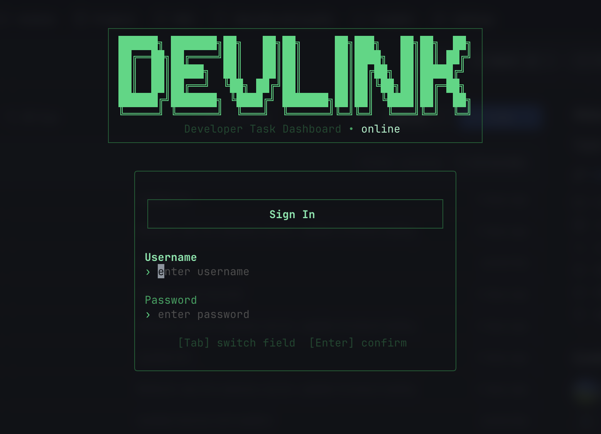
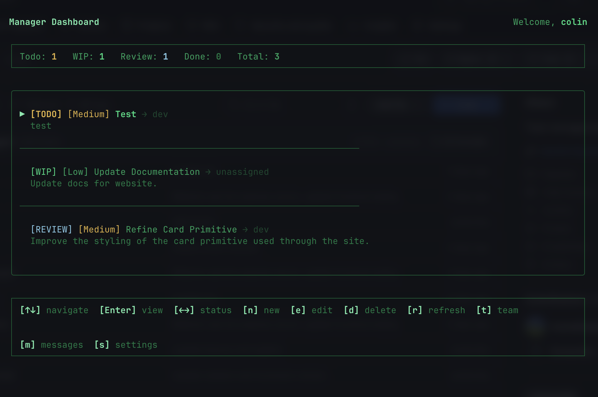

# [DEVLINK](https://devlink.fly.dev) (DEMO)

*Author: [Colin M Foster](https://namedotget.com)*

## Notice
This repository is licensed under PolyForm Noncommercial 1.0.0.
Use is permitted for noncommercial purposes only.
For interview evaluation and technical review only.

~~~~~~~~~~~~~~~~~~~~~~~~~~~~~~~~~~~~~~~~~~~~~~~~~~

Devlink is a dev task dashboard for your team.

Manage tasks and send messages in a group chat.

All from your terminal.

~~~~~~~~~~~~~~~~~~~~~~~~~~~~~~~~~~~~~~~~~~~~~~~~~~





# Features
- Task dashboard
- Task view where you can like and comment
- Team/role management
- Team chat w/ mobile support using [Linq](https://linqapp.com)

# Dev Guide

Please follow this guide to get the project up and running.
Make sure to read the [LICENSE](./LICENSE) before using this code elsewhere.
All devs welcome! If you'd like to help improve this project please submit a PR and I will review it.

### Neon DB
Go to [neon.tech](https://neon.tech) and create an account or login.

Create a new project, click the 'Overview' tab on the left side and then click the 'Connect' button.

Copy and paste the db url into .env 

1. Setup Database
```bash
npx tsx scripts/setup-db.ts
```

2. Create your first account
```bash
npx tsx scripts/create-user.ts --username=<name> --email=<email> --password=<pass> --role=manager
```

### Linq
Go to [linqapp.com](https://linqapp.com) and request access to the Sandbox.
Paste your Linq api key and virtual number into .env

The team chat will be tied to virtual number, anytime someone sends a chat and has their mobile number connected it will be routed through the virtual number.

### Groq (coming soon...)
Working on adding AI features, the server has a route for ai chat but it isn't hooked up to the frontend.

### Server

1. Create .env and populate w/ environment variables
```bash
cd server/ && cp .env.example .env
```

2. Install deps for server
```bash
yarn install
# or
npm install
```

3. Start dev server
```bash
yarn dev
# or
npm run dev
```

### TUI

1. Create .env and populate w/ environment variables
```bash
cp .env.example .env
```

2. Install deps for TUI
```bash
yarn install
# or
npm install
```

3. Start dev TUI
```bash
yarn dev
# or 
npm run dev
```